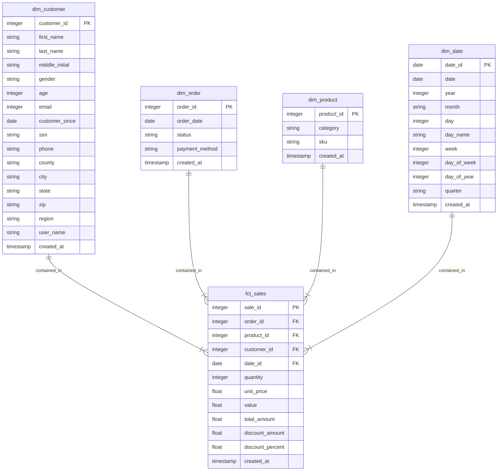

# Data Engineering Project: US Sale Pipeline & Dashboard

## Overview
Data Pipeline that ingests **US Sales** Data from local CSV file. Then data is loaded to the local 
Postgres database and Google BigQuery for further transformation. DBT is used to transform data
in BigQuery and Dash is used for visualizing data.
## Architecture
## Data Sources
[US Sale Dataset](https://www.kaggle.com/datasets/ytgangster/online-sales-in-usa) is from [Kaggle](www.kaggle.com)
### About the dataset
The dataset of online sales in the USA is about the sales of different products, merchandise, and electronics in different states.
Since a huge chunk of the people who have internet access are switching to online shopping, large retailers are 
actively searching for ways to increase their profit. Sales analysis is one such key technique used by large retailers to increase
sales by understanding the customers' purchasing behavior & patterns. Market basket analysis examines collections of items to find
relationships between items that go together within the business context.

## Data Pipeline
### Dimensional Modeling

