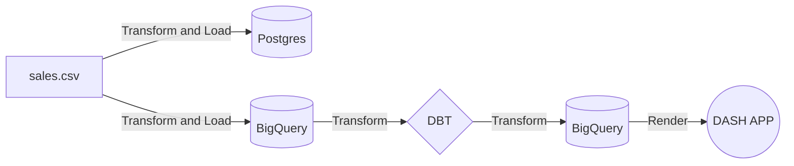

# Data Engineering Project: US Sale Pipeline & Dashboard

## Overview
Data Pipeline that ingests **US Sales** Data from local CSV file. Then data is loaded to the local 
Postgres database and Google BigQuery for further transformation. DBT is used to transform data
in BigQuery and Dash is used for visualizing data with interactive dashboards.
## Data Sources
[US Sale Dataset](https://www.kaggle.com/datasets/ytgangster/online-sales-in-usa) is from [Kaggle](www.kaggle.com)
### About the dataset
The dataset of online sales in the USA is about the sales of different products, merchandise, and electronics in different states.
Since a huge chunk of the people who have internet access are switching to online shopping, large retailers are
actively searching for ways to increase their profit. Sales analysis is one such key technique used by large retailers to increase
sales by understanding the customers' purchasing behavior & patterns. Market basket analysis examines collections of items to find
relationships between items that go together within the business context.

## Data Pipeline


###  Tools and dependencies
- Pandas: Pandas is a popular open-source library in Python used for data manipulation and analysis.
- Dash: Dash is a productive web application framework in Python used for building interactive web applications.
  It is based on Flask, Plotly, and React.js, and allows you to create data-driven applications with a user-friendly interface. 
- DBT: Stands for "Data Build Tool", a transformation framework that uses SQL and Jinja templating allowing users to transform data in various
  databases and data warehouses: BigQuery, Snowflake, RedShift, Postgres, SQL Server ..etc.
- Postgres: open-source relational database management system
- Google BigQuery: Google's distributed analytic database or data warehouse.

### Project Structure
```
.
├── dataset
├── etl
├── src
│   ├── components
│   ├── data
│   └── postgres_migration
└── us_sale_project
    ├── analyses
    ├── dbt_packages
    ├── macros
    ├── models
    │   ├── dim
    │   ├── fct
    │   ├── obt
    │   └── stg
    ├── seeds
    ├── snapshots
    └── tests
```
#### Directory Description
- **dataset**: raw and preprocessed US Sales dataset in CSV format
- **etl**: python scripts that handle some initial data preprocessing before loading to Postgres and BigQuery
- **src**: python scripts that handle building Dash app
- **us_sale_project**: DBT project folder. There are 3 directories in dbt models directory:
  - **dim**: models for dimension tables
  - **fct**: model for fact sales table
  - **obt**: model for one big table
  - **stg**: model for staging layer

### Dimensional Modeling
#### US Sale Schema in Google BigQuery

## Dash App

