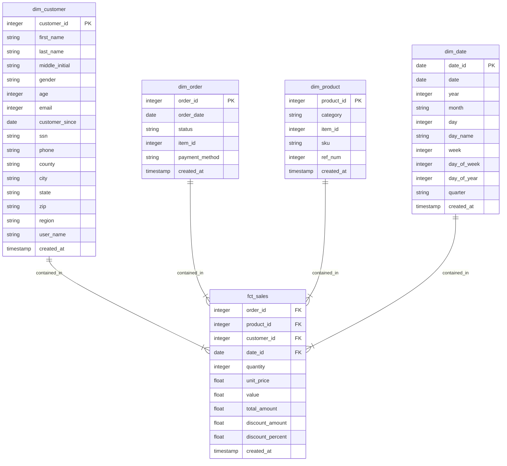

# Dimensional Modeling

## US Sale Transaction

```mermaid
erDiagram
    dim_customer ||--|{ fct_sales: contained_in
    dim_customer {
        integer customer_id PK
        string first_name
        string last_name
        string middle_initial
        string gender
        integer age
        integer email
        date customer_since
        string ssn
        string phone
        string county
        string city
        string state
        string zip
        string region
        string user_name
        timestamp created_at
    }
    dim_order ||--|{ fct_sales: contained_in
    dim_order {
        integer order_id PK
        date order_date
        string status
        integer item_id
        string payment_method
        timestamp created_at
    }
    dim_product ||--|{ fct_sales: contained_in
    dim_product {
        integer product_id PK
        string category
        integer item_id
        string sku
        integer ref_num
        timestamp created_at

    }
    dim_date ||--|{ fct_sales: contained_in
    dim_date {
        date date_id PK
        date date
        integer year
        string month
        integer day
        string day_name
        integer week
        integer day_of_week
        integer day_of_year
        string quarter
        timestamp created_at
    }
    fct_sales {
        integer order_id FK
        integer product_id FK
        integer customer_id FK
        date date_id FK
        integer quantity
        float unit_price
        float value
        float total_amount
        float discount_amount
        float discount_percent
        timestamp created_at
    }
```

